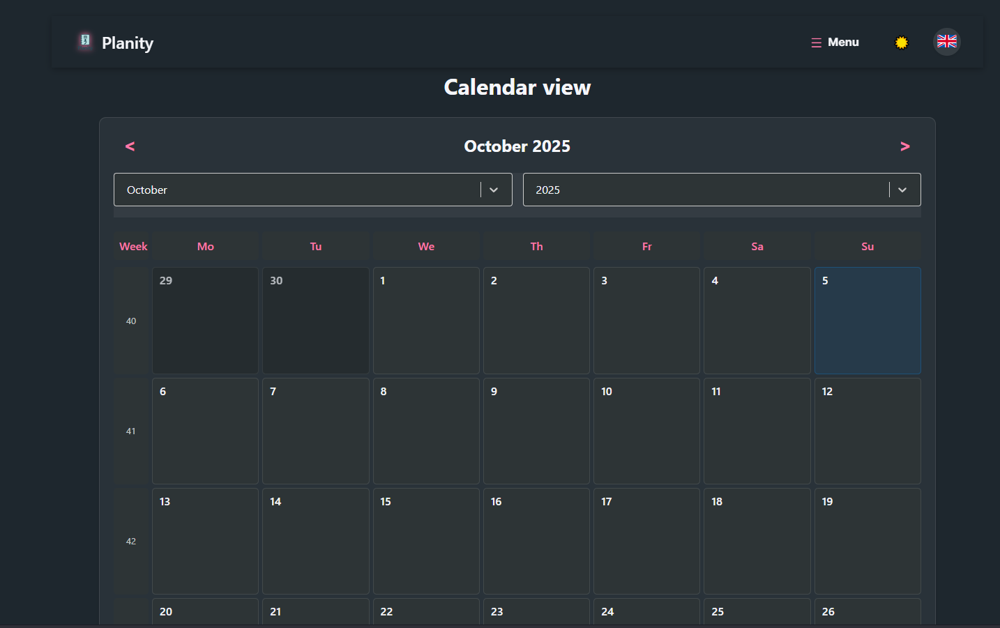
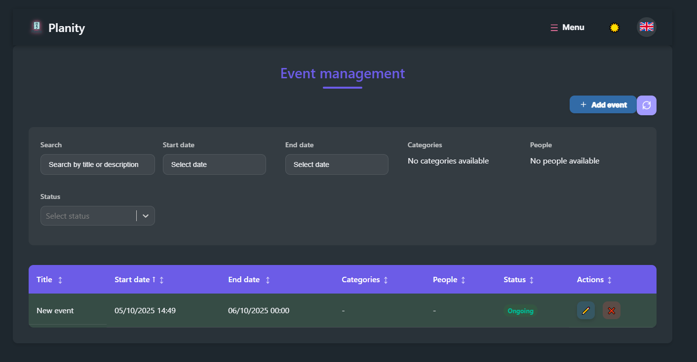
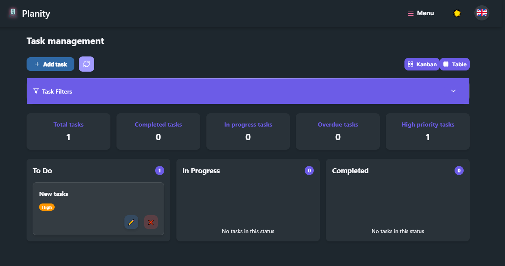

# 📋 Planity — Personal Organizer App
[](https://opensource.org/licenses/Apache-2.0)
[](https://reactjs.org/)
[](https://nodejs.org/)


**Planity** is a cross-platform application designed to centralize the management of your tasks, events, notes, and contacts in a clean, intuitive interface.







## 🚀 Core Features

- ✅ **Task Management**: Create, edit, prioritize, and track tasks with reminders and due dates.
- 📅 **Event Calendar**: Schedule appointments, meetings, and events with customizable views (day/week/month).
- 📝 **Note Taking**: Capture ideas or lists with fast search.
- 👥 **Contact Book**: Organize contacts with custom fields, grouping, and event integration.


## 🧑‍💻 For Developers

### 📦 Installation
```bash
npm install
```

### 🧪 Start in Development Mode
```bash
npm run start:dev
```
This launches both the client and server in parallel using npm-run-all.


### 🛠️ Available Scripts

| Script              | Description                                          |
|---------------------|------------------------------------------------------|
| `npm run start`     | Starts client + server                               |
| `npm run start:dev` | Starts client + server in development mode           |
| `npm run build`     | Builds the client and generates executable with `pkg`|


## 🐳 Running with Docker

### 🔧 Build the Image

```bash
docker build -t planity .
```

### ▶️ Run the Container

```bash
docker run -p 5000:5000 planity
```

## 🖥️ Running as Executable (.exe)

After running npm run build, the .exe files are generated in the dist/ folder.

### ▶️ Launch the Application
```bash
./dist/planity-win.exe
```

Compatible with Windows, macOS, and Linux via pkg.targets.

## 📄 License

This project is licensed under Apache 2.0 — see the [LICENSE](LICENSE) file for details.